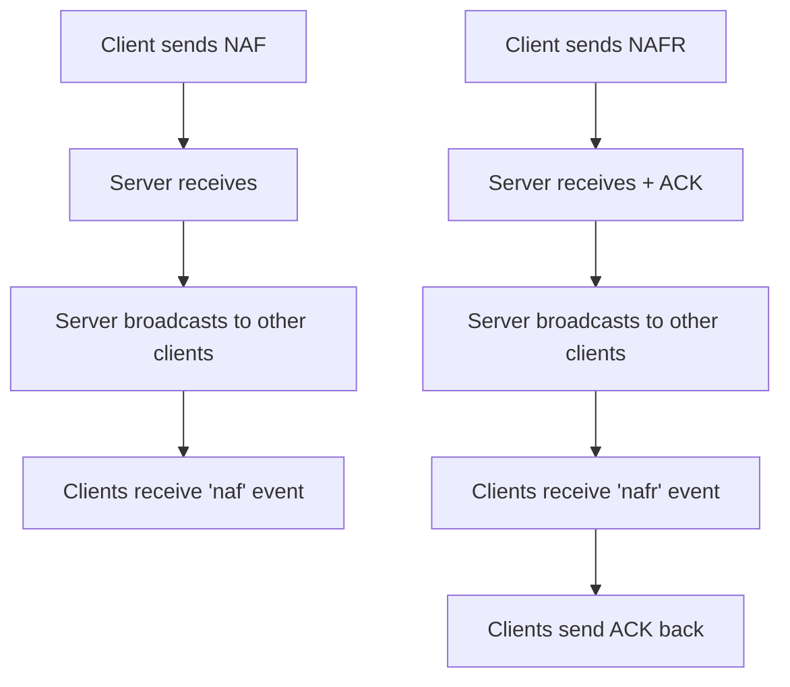

# NAF (Networked A-Frame) Protocol

NAF is the networking protocol used for synchronizing 3D objects and avatar states in virtual environments.

## Message Types

### NAF (Unreliable Messages)
- **Protocol**: UDP-like, best-effort delivery
- **Use Case**: Frequent updates where some packet loss is acceptable
- **Examples**: Position updates, rotation changes, animation states
- **Characteristics**:
  - Low latency
  - No delivery guarantees
  - Suitable for high-frequency updates
  - Packet loss won't break functionality

### NAFR (Reliable Messages) 
- **Protocol**: TCP-like, guaranteed delivery
- **Use Case**: Critical state changes that must arrive
- **Examples**: Avatar spawn/despawn, important state transitions
- **Characteristics**:
  - Higher latency due to acknowledgments
  - Guaranteed delivery
  - Used sparingly for critical updates
  - Every packet must arrive for correct functionality

## Implementation Details

### Sending Messages

```typescript
import { NafMessageBuilder } from '@metatell/bot-sdk'

// For frequent position updates (unreliable)
const nafUpdate = new NafMessageBuilder()
  .withDataType('um')
  .withNetworkId(sessionId)
  .withOwner(sessionId)
  .withCreator(sessionId)
  .withPosition({ x: 1, y: 2, z: 3 })
  .build()
await messageService.sendNAF(nafUpdate)

// For critical state changes (reliable) - e.g., spawning an avatar
const spawnMessage = new NafMessageBuilder()
  .withDataType('u')
  .withNetworkId(sessionId)
  .withOwner(sessionId) 
  .withCreator(sessionId)
  .withFirstSync(true)
  .withAvatar({
    avatarSrc: `https://storage.metatell.app/avatars/${avatarId}/avatar.gltf`,
    avatarType: 'skinnable'
  })
  .build()
await messageService.sendNAFR(spawnMessage)
```

### Receiving Messages

```typescript
// Listen for unreliable updates
messageService.on('naf', (data) => {
  // Handle frequent updates (position, rotation, etc.)
})

// Listen for reliable messages
messageService.on('nafr', (data) => {
  // Handle critical state changes
})
```

## Message Structure

NAF messages follow this general structure:

```typescript
interface NAFMessage {
  dataType: string    // Message type ('u', 'um', 'r', etc.)
  data: unknown      // Message payload
  from_session_id?: string // Sender session ID
}
```

### Common Data Types

- `'u'`: User spawn/initial state
- `'um'`: User update (position/rotation)  
- `'r'`: Remove/despawn

### Component IDs

NAF uses numeric IDs to identify component types:

- `0`: Position
- `1`: Velocity
- `2`: Scale
- `3`: Avatar
- `4`: Head Rotation
- `5`: Left Hand Rotation
- `6`: Right Hand Rotation
- `7`: Left Hand Position
- `8`: Right Hand Position
- `9`: Hand Raised
- `10`: Pin Position
- `11`: Pin Scale
- `12`: Face Snapshot Enabled
- `13`: Face Snapshot / VRM Avatar Status (also used for animation state)
- `14`: Body Rotation

**Note**: Component ID 13 is used both for face snapshots and VRM avatar animation states for compatibility with vrm-avatar-status-manager.

## Best Practices

1. **Use NAF for frequent updates**: Position, rotation, animations
2. **Use NAFR for critical state**: Spawn, despawn, important state changes
3. **Minimize NAFR usage**: Only for messages that absolutely must arrive
4. **Handle packet loss gracefully**: NAF messages may be lost, design accordingly
5. **Keep messages small**: Larger payloads increase chance of loss and latency

## Event Flow



## Debugging

Enable NAF message debugging:

```typescript
// Enable debug mode to see NAF traffic
appSettings.setDebugMode(true)
```

This will log all incoming NAF/NAFR messages with `[NAF RECEIVED]` and `[NAFR RECEIVED]` prefixes.