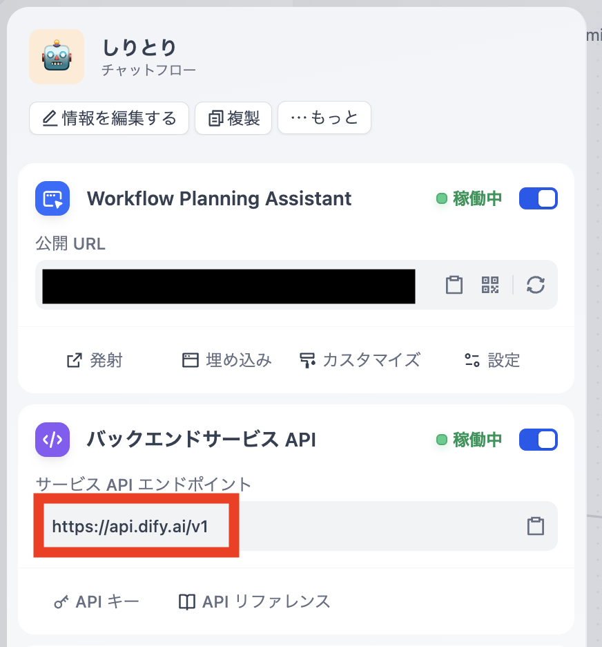
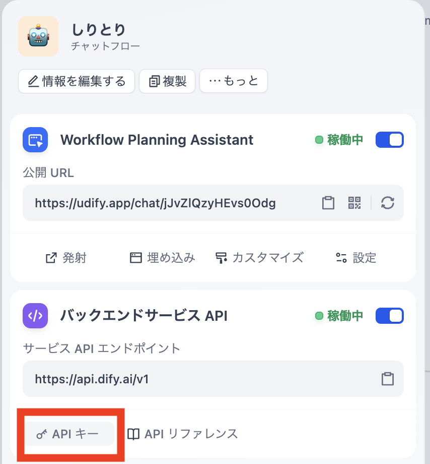

# Dify Bot Example

MetaTell AI Bot と Dify を統合したチャットボットの実装例です。
このボットはメンションされたメッセージをDify APIに送信し、AIの応答を返します。

## セットアップ

### 0. 開発環境のセットアップ
Node.js 22をインストールしてください。

リポジトリのクローン
```bash
git clone https://github.com/urth-inc/metatell-ai-bot.git
cd examples/dify-bot
```

### 1. 環境変数の設定

`.env.example` をコピーして `.env` ファイルを作成し、Difyの認証情報を設定します。

```bash
cp .env.example .env
```

`.env` ファイルを編集：
```
DIFY_API_KEY=your-dify-api-key-here
DIFY_APP_ID=your-dify-app-id-here
BOT_USERNAME=DifyBot
# DIFY_STREAMING_MODE=false  # ストリーミングモードを無効にする場合のみ設定
```

### 2. 依存関係のインストール

```bash
npm ci
```

### 3. ビルド

```bash
npm run build
```

### 4. 実行

```bash
npm start https://urth.metatell.app/XrAU8NY/
```

## 機能

- **Dify統合**: メンションされたメッセージをDify APIに送信し、AIの応答を返します
- **ストリーミングレスポンス**: デフォルトでストリーミングモードが有効化され、リアルタイムで応答が表示されます
- **会話の継続性**: ユーザーごとに会話履歴を保持
- **自動応答**: ボットへのメンションに自動的に応答
- **アバター制御**: ユーザーを追跡し、適切なアニメーションを再生

## コード構成

```
src/
├── main.ts              # メインエントリーポイント
├── config/              
│   └── index.ts        # 環境変数設定の管理
├── services/            
│   └── dify-client.ts  # Dify API通信クライアント
└── handlers/            
    ├── chat-handler.ts # チャットメッセージの処理
    └── avatar-handler.ts # アバターの動作制御
```

## Difyの設定

1. アプリを作成または選択
2. `.env.example`ファイルをコピーして`.env`ファイルを作成
3. `DIFY_API_URL`と`DIFY_API_KEY`と`DIFY_APP_ID`を`.env`ファイルに設定
    * `DIFY_API_URL`は環境により異なります
        * Dify Cloudの場合: `https://api.dify.ai/v1`
        * Dify Self-hostedの場合は各々の環境に合わせて設定してください。
        
    * `DIFY_API_KEY`はAPI設定から生成したキーを設定してください。
        
    * `DIFY_APP_ID`はURLから取得できます。
        * 例: https://cloud.dify.ai/app/6408edfb-999b-4090-8598-8586ed720fb4/workflow
        * `6408edfb-999b-4090-8598-8586ed720fb4` が`DIFY_APP_ID`

## ストリーミングモード

デフォルトではストリーミングモードが有効になっており、Dify APIからの応答がリアルタイムで表示されます。

### ストリーミングモードの特徴

- **リアルタイム応答**: AI生成中のテキストが段階的に表示される
- **ユーザー体験の向上**: 長い応答でも待機時間が短縮される  
- **バッチ処理**: 100ms間隔でメッセージをバッチ送信し、効率的な表示を実現

### ストリーミングモードの無効化

環境変数 `DIFY_STREAMING_MODE` を `false` に設定することで、従来のブロッキングモード（一括応答）に切り替えることができます。

```bash
DIFY_STREAMING_MODE=false
```
