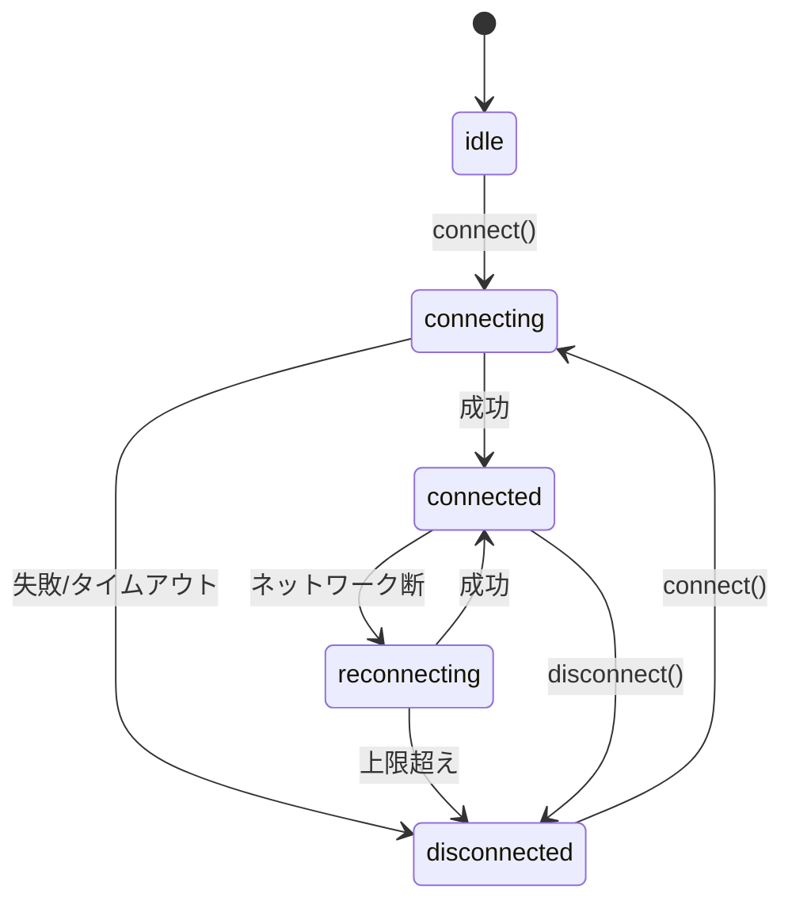

# Metatell AI Bot SDK — 音声I/O拡張 仕様書 (v2.0)

## 1\. 目的とスコープ

### 1.1. 目的

本仕様は、`@metatell/sdk`にリアルタイム音声コミュニケーション機能を追加するための技術仕様を定義します。主たる通信手段としてLiveKitを採用し、サーバーサイドBotが音声の送受信およびデータ通信を行えるようにします。
LiveKit SDKは `@livekit/rtc-node` とし、本SDKではこれを抽象化インターフェイスでラップします。

### 1.2. スコープ

  * **IN SCOPE**:
      * LiveKitを通信バックエンドとして利用するための**抽象トランスポートインターフェイス**の定義
      * LiveKit SDKをラップする**アダプター層**の実装指針
      * 接続、状態管理、データ送受信、音声トラック制御に関するAPIサーフェスの定義
      * セキュリティ、テスト、段階的導入に関する基本方針の策定
  * **OUT OF SCOPE**:
      * LiveKitサーバーのインフラ構築および運用
      * STT (Speech-to-Text) / LLM / TTS (Text-to-Speech) の具体的な実装
      * LiveKitのルーム参加やトークン発行を行うアプリケーションバックエンドの実装（SDKは`TokenProvider`を受け取るのみ）
      * SSEによるフォールバック実装（PoCフェーズでは不要と判断）

-----

## 2\. アーキテクチャ

### 2.1. 基本方針

SDKコアとリアルタイム通信技術（LiveKit）の**完全な分離**を目指します。これにより、ベンダーロックインを回避し、SDKコアのテスト容易性と保守性を高めます。

### 2.2. コンポーネント

1.  **SDK Core**: Botのコアロジック。`RealtimeTransport`インターフェイスにのみ依存します。
2.  **`RealtimeTransport` (抽象インターフェイス)**: 接続、イベント、送受信など、リアルタイム通信に必要な機能を抽象的に定義します。LiveKitの語彙を含みません。
3.  **`LiveKitTransport` (アダプター)**: `RealtimeTransport`インターフェイスの具象クラス。内部で`livekit-client` SDKをラップし、LiveKit固有のAPIコールやイベントを抽象インターフェイスに変換します。

-----

## 3\. SDK利用例 (基本編)

SDK利用者は、`RealtimeTransport`のような内部実装を意識することなく、以下のようなシンプルで高レベルなAPIを通じて音声機能を利用します。

### 3.1. コード例

```typescript
import { createAgentClient, AgentClient } from '@metatell/ai-bot-sdk';

// STTやTTSサービスとの連携を想定した擬似関数
declare function sendToSttService(pcmData: Int16Array): Promise<string>;
declare function getPcmFromTtsService(text: string): AsyncGenerator<Int16Array>;


// 1. SDKクライアントの初期化
const client: AgentClient = createAgentClient();

/**
 * 他の参加者からの音声フレームを受信したときの処理
 */
client.on('voiceFrameReceived', async (participantId, pcmData) => {
  // 受信したPCMデータをSTTサービスに送信
  console.log(`Received audio from ${participantId}, size: ${pcmData.length}`);
  const transcript = await sendToSttService(pcmData);

  if (transcript) {
    console.log(`Transcript from ${participantId}: ${transcript}`);
    // ここでLLMにテキストを渡して応答を生成するなどの処理を行う
    // const llmResponse = await askLlm(transcript);
    // speak(llmResponse);
  }
});

/**
 * Botが発話（音声送信）する処理
 */
async function speak(text: string) {
  try {
    // TTSサービスから音声ストリーム（PCMチャンク）を取得
    const pcmStream = getPcmFromTtsService(text);

    // チャンクが届くたびに、SDK経由で送信する
    for await (const pcmChunk of pcmStream) {
      await client.sendVoiceFrame(pcmChunk);
    }
    console.log(`Finished speaking: "${text}"`);

  } catch (error) {
    console.error('Failed to send voice frame:', error);
  }
}

/**
 * メインの実行関数
 */
async function main() {
  try {
    // 2. 接続（この時点で音声セッションも有効化）
    console.log('Connecting to Metatell with voice enabled...');
    await client.connect({
      url: 'https://metatell.app/your-room',
      token: 'your-auth-token',
      // voiceオプションで音声機能を有効化
      voice: {
        enabled: true,
      }
    });
    console.log('Connection successful. Voice session is active.');

    // 3. (例) 3秒後に挨拶を発話する
    setTimeout(() => {
      speak("皆さん、こんにちは。AIボットです。");
    }, 3000);

  } catch (error) {
    console.error('SDK operation failed:', error);
  }
}

// 実行
main();

// ---------------------------------------------
// その他の操作例
// ---------------------------------------------

// Bot自身のマイク（音声送信）をミュートする
async function muteBot() {
  await client.muteVoice(true);
  console.log('Bot microphone muted.');
}

// ミュートを解除する
async function unmuteBot() {
  await client.muteVoice(false);
  console.log('Bot microphone unmuted.');
}

// セッションを切断する
async function disconnect() {
  await client.disconnect();
  console.log('Disconnected from all sessions.');
}
```

### 3.2. 解説

  * **シンプルなAPI**: `connect`メソッドのオプションで`voice: { enabled: true }`を指定するだけで音声セッションが開始されます。LiveKitへの接続やトラックの送受信といった複雑な処理はSDKが内部で自動的に行います。
  * **音声受信**: 他の参加者からの音声は、`client.on('voiceFrameReceived', ...)`でイベントとして通知されます。利用者は送られてくるPCMデータ（`Int16Array`）をSTTサービスに渡すことだけに集中できます。
  * **音声送信**: Botが話す場合は、`client.sendVoiceFrame(pcmData)`メソッドでPCMデータを送信するだけです。
  * **内部実装の隠蔽**: SDK利用者は、`RealtimeTransport`のような内部APIを意識する必要はありません。SDKが内部のアダプター層で技術的な詳細を吸収します。

-----

## 4\. 抽象API仕様 (SDK内部設計)

SDKコアが利用する抽象インターフェイス`RealtimeTransport`と、それを構成する型を以下に定義します。

### 4.1. 抽象インターフェイス `RealtimeTransport`

```typescript
// 責務: リアルタイム通信のライフサイクル管理と基本的な送受信機能を提供する
export interface RealtimeTransport {
  /**
   * 現在の接続状態を返す。
   * MUST: この状態は、本仕様書で定義された状態遷移図に従う。
   */
  readonly state: ConnectionState;

  /**
   * トランスポート層からのイベントを購読する。
   * MUST: 戻り値として、購読を解除するための関数を返す。
   */
  on(listener: (e: TransportEvent) => void): () => void;

  /**
   * サーバーへの接続を開始する。
   * MUST: 接続処理中の重複呼び出しはエラーとする。
   */
  connect(opts: RealtimeOptions): Promise<void>;

  /**
   * 接続を切断する。
   * SHOULD: 2秒以内にリソース解放を完了させる。
   */
  disconnect(): Promise<void>;

  /**
   * 指定された論理データチャネルにデータを送信する。
   * MUST: 存在しないチャネル名を指定された場合はエラーを返す。
   */
  send(channel: string, data: Uint8Array | string): Promise<void>;

  /**
   * マイク（音声トラックの送信）の有効/無効を切り替える。
   */
  setMicEnabled(enabled: boolean): Promise<void>;

  /**
   * スピーカー（リモート音声トラックの再生）の有効/無効を切り替える。
   */
  setSpeakerEnabled(enabled: boolean): Promise<void>;
}
```

### 4.2. 主要な型定義

  * **`ConnectionState`**: 接続のライフサイクルを示す型。

    ```typescript
    export type ConnectionState =
      | 'idle' | 'connecting' | 'connected' | 'reconnecting' | 'disconnected';
    ```

  * **`RealtimeOptions`**: 接続に必要な設定情報。

    ```typescript
    export interface RealtimeOptions {
      url: string;                 // wss://<livekit-host>
      tokenProvider: () => Promise<string>; // トークンを非同期に取得する関数
      autoSubscribe?: boolean;     // 既定: true
      audio?: { publish?: boolean; play?: boolean; };
      dataChannels?: string[];     // 例: ['control', 'events', 'transcript']
    }
    ```

  * **`TransportEvent`**: トランスポート層から通知されるイベント。

    ```typescript
    export type TransportEvent =
      | { type: 'state'; state: ConnectionState }
      | { type: 'participant-joined'; id: string }
      | { type: 'participant-left'; id: string }
      | { type: 'track-added'; id: string; kind: 'audio'|'video'; remote: boolean }
      | { type: 'data'; channel: string; payload: Uint8Array }
      | { type: 'error'; code: string; message: string; cause?: unknown };
    ```

-----

## 5\. ライフサイクルと状態遷移

接続状態は以下の図に従って遷移しなければなりません（MUST）。



  * **状態通知**: `state`が変化した場合、必ず`{ type: 'state', state: newState }`イベントが発火されなければなりません（MUST）。
  * **順序保証**: すべてのイベントは内部で単調増加するIDを持ち、重複して発火してはなりません（MUST）。

-----

## 6\. データチャネル

  * **予約名**: `control`, `events`, `transcript` を標準的なチャネル名として予約します。
  * **QoS**: デフォルトのサービス品質は低遅延を優先し、`reliable=false`とします。
  * **背圧制御**: 送信キューが上限（例: 512）を超えた場合、最も古いメッセージを破棄し、`warning`をログに出力しなければなりません（MUST）。

-----

## 7\. セキュリティ

  * **トークン発行**: `TokenProvider`は、有効期間が短い（例: 60秒）トークンを発行しなければなりません（MUST）。トークンが失効した場合、`LiveKitTransport`は`TokenProvider`を再呼び出ししてトークンを再取得し、接続を試みます。
  * **権限**: 発行されるトークンは、必要なルームと機能に限定された最小権限を持つべきです（SHOULD）。

-----

## 8\. テスト計画

  * **単体テスト**: `LiveKitTransport`のロジック（状態遷移、イベントマッピング、背圧制御）をテストします。
  * **統合テスト**: ヘッドレスクライアントを用いて、実際のLiveKitサーバーとの間でデータチャネルの疎通とRTTを計測します。
  * **回線劣化テスト**: ネットワークシミュレーション下で再接続の安定性を検証します。

-----

## 9\. 導入計画

PoCフェーズでは速度を最優先し、以下の段階的アプローチを取ります。

1.  **抽象化レイヤーの導入**: `RealtimeTransport`インターフェイスと`LiveKitTransport`アダプターを実装します。
2.  **SSEフォールバックの除外**: PoCではSSEによるフォールバック機構は実装しません。LiveKit接続に失敗した場合はエラー終了とします。
3.  **Botコアへの統合**: Botのメインロジックが`LiveKitTransport`を利用して接続・通信できるようにします。
