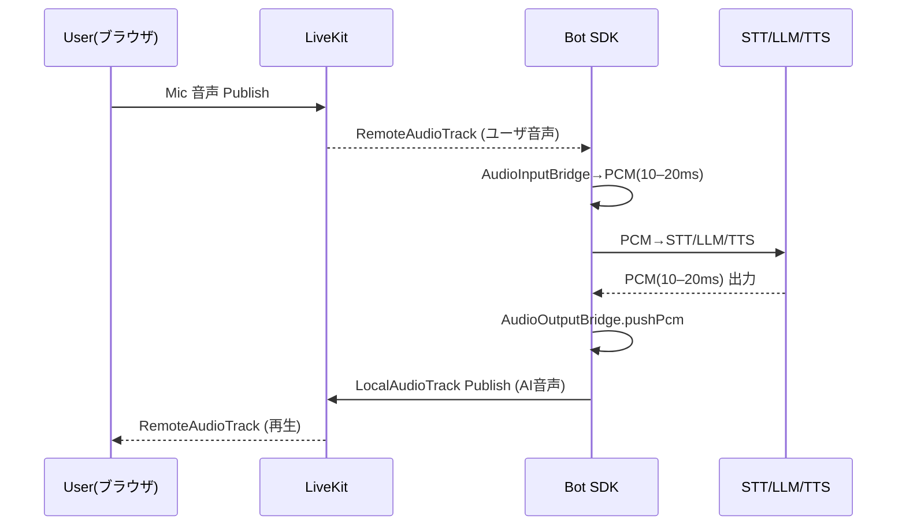
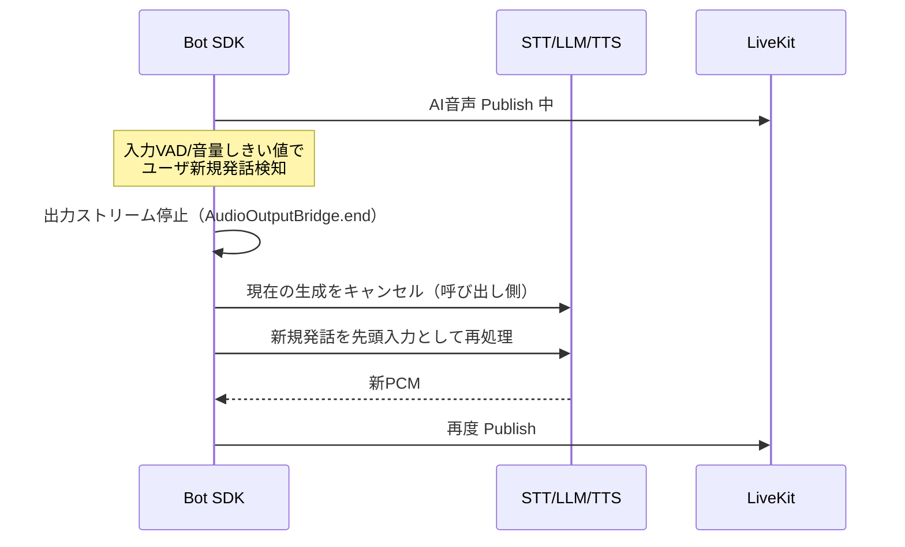
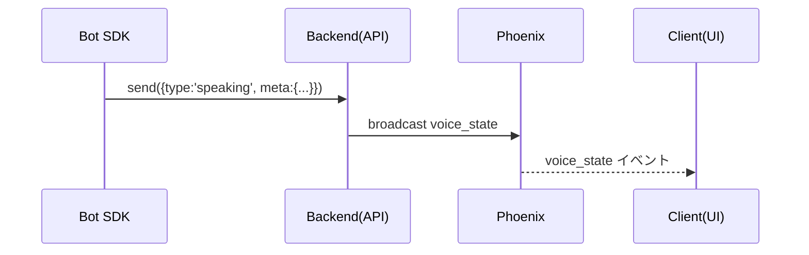
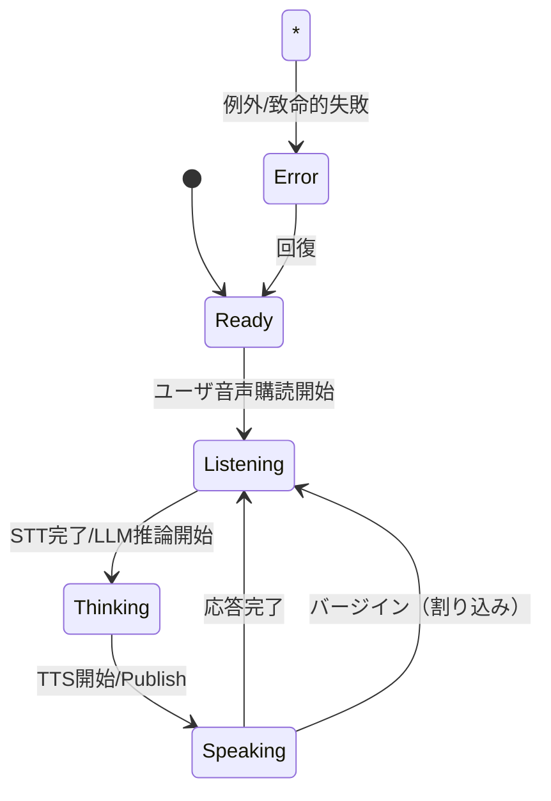

# Metatell AI Bot SDK — 音声I/O拡張 仕様書

## 0. スコープと非スコープ

* **スコープ**

  * Bot SDK に「LiveKit を用いた音声入力（購読）/音声出力（発話）」の**抽象I/F**を追加
  * Phoenix（既存：NAF/NAFR）の**状態・制御**と連携する**標準フック**を定義
* **非スコープ**

  * ルーム選択・LiveKit 参加/トークン発行（＝アプリ/Backendの責務）
  * STT/LLM/TTS の内部アルゴリズム（SDKはPCMストリームI/Fのみ提供）

## 1. 前提/制約

* Bot は**サーバ側プロセス**（NAFエミュレーション＋PhoenixChannel で世界と通信）。
* 音声は **LiveKit**（ブラウザは実装済み／Bot側が未実装）。
* SDK は **接続済み LiveKit Room の参照のみ受け取る**（join はしない）。
* 既定音声フォーマット：**PCM Int16 / 48 kHz / Mono / 10–20 ms フレーム**。
* オペレーション：監視は Datadog/Honeycomb/Mackerel、エラーは Sentry に統合。

---

## 2. 全体アーキテクチャ（論理）

```mermaid
flowchart LR
  subgraph Client["Metaverse Client (Browser)"]
    PHX[Phoenix WS<br/>NAF/NAFR/Presence]
    LKC[LiveKit SDK<br/>音声(実装済)]
  end

  subgraph Backend["Metatell Backend"]
    PHOENIX[Phoenix<br/>配信/Presence]
    TOKEN[LiveKit Token Service]
    API[Agent State API<br/>(REST/gRPC)]
  end

  subgraph LiveKit["LiveKit (SFU)"]
    SIG[Signaling]
    RTP[RTP/SRTP]
  end

  subgraph Bot["Bot Service (Server)"]
    SDK[Bot SDK 音声I/O拡張]
    VSM[VoiceSessionManager]
    AIN[AudioInputBridge]
    AOUT[AudioOutputBridge]
    VSP[VoiceStatePublisher]
  end

  Client <-->|制御/状態| PHOENIX
  Client <--> LKC
  Backend --> TOKEN
  Bot <--> PHOENIX
  Bot -.bindRoom.-> VSM
  VSM --> AIN
  VSM --> AOUT
  VSP --> API
  LKC <--> LiveKit
  AIN <--> LiveKit
  AOUT <--> LiveKit
```

* **制御/状態**：Phoenix（既存）。
* **音声**：LiveKit（低遅延）。
* **SDK**：接続済み `room` を **bind** し、入出力と状態フックのみ提供。

---

## 3. ユースケース（代表）

1. **フルデュープレックス対話**：

   * ユーザ発話 → Bot(STT/LLM/TTS) → AI音声返答（同時並行）
2. **バージイン（割り込み）**：

   * Bot 発話中にユーザの新規発話を検知 → Bot 発話中断 → 新対話へ遷移
3. **無音最適化**：

   * VAD で無音区間を抑制 → STT課金・レイテンシ最適化
4. **状態同期**：

   * `ready / thinking / speaking / idle / error` を Backend API → Phoenix → クライアントUI

---

## 4. 公開I/F（仕様）

> ルーム接続は扱わない。**`bindRoom(room)` のみ**受け付ける。

```ts
/** LiveKit の接続済み Room を束ね、音声 I/O を提供する最小抽象 */
export interface LiveKitVoiceSessionManager {
  /** 接続済みの Room を注入（1回のみ／差し替え不可） */
  bindRoom(room: unknown): void;

  /** ユーザ音声（RemoteAudioTrack）の購読 → PCM 供給 */
  createInput(opts?: VoiceInputOptions): IVoiceInputBridge;

  /** Bot音声（PCM）の発話 → LocalAudioTrack 公開 */
  createOutput(opts?: VoiceOutputOptions): IVoiceOutputBridge;

  /** 状態送出フック（Backend API 差し替え可能） */
  createStatePublisher(sender: (state: VoiceState) => Promise<void>): VoiceStatePublisher;
}

/** 入力（購読） */
export interface IVoiceInputBridge {
  on(event: 'frame', cb: (pcm: Int16Array) => void): void; // 10–20ms
  setVadEnabled(enabled: boolean): void;                   // 実装は差し替え可能
  close(): void;
}

/** 出力（発話） */
export interface IVoiceOutputBridge {
  init(): Promise<void>;                    // AudioTrack 生成・公開
  pushPcm(pcm: Int16Array): Promise<void>;  // 10–20ms チャンク
  end(): Promise<void>;
}

/** オプション（既定値は括弧内） */
export type VoiceInputOptions  = { sampleRate?: 48000; channels?: 1|2; frameMs?: 10|20|40; vad?: boolean };
export type VoiceOutputOptions = { sampleRate?: 48000; channels?: 1|2; frameMs?: 10|20|40; trackName?: string /* 'ai-voice' */ };

/** 状態モデル（必要最小） */
export type VoiceState =
  | { type: 'ready' }
  | { type: 'thinking';  meta?: any }
  | { type: 'speaking';  meta?: { utteranceId?: string } }
  | { type: 'idle' }
  | { type: 'error';     meta: { code: string; message?: string } };

export interface VoiceStatePublisher {
  send(state: VoiceState): Promise<void>;
}
```

**設計意図**

* join/roomId/token は **SDK外**。
* 音声I/Oは **PCM固定（Int16/48k/mono/10–20ms）**。
* 状態は**抽象フック**（Backend API 方式は利用側が決める）。

---

## 5. 主要フロー（シーケンス）

### 5.1 音声往復



### 5.2 バージイン（割り込み）



### 5.3 状態同期



---

## 6. 状態遷移（Bot音声の基本ライフサイクル）



---

## 7. 詳細設計（内部）

### 7.1 VoiceSessionManager（VSM）

* **責務**：

  * `bindRoom(room)` で LiveKit の Room 参照を保持（1回限り）
  * `createInput()`/`createOutput()` の**生成とライフサイクル管理**
  * LiveKit Room のイベント（`trackSubscribed`/`disconnected` 等）をブリッジへ通知
* **前提**：Node 環境。LiveKit のサーバ SDK（例：`@livekit/rtc-node`）を利用。

### 7.2 AudioInputBridge

* **入力**：LiveKit RemoteAudioTrack
* **出力**：`on('frame')` で **PCM(Int16/48k/mono/10–20ms)** を連続発火
* **VAD**：`setVadEnabled(true|false)` のみ標準化（実実装＝差し替え可能：Silero等）
* **誤動作対策**：音量しきい値・短時間窓でのヒステリシス可

### 7.3 AudioOutputBridge

* **入力**：PCM(Int16/48k/mono/10–20ms)
* **処理**：内部送出バッファ（約50ms想定）へ順次 `push`、**Backpressure** 対応
* **出力**：LocalAudioTrack Publish
* **中断**：`end()` で即停止（バージイン/切断時）

### 7.4 VoiceStatePublisher

* **契約**：`send(VoiceState)` だけ（配送方式は呼び出し側DI）
* **推奨**：Backend API（REST/gRPC） → Phoenix Fan-out

---

## 8. 設定・運用

### 8.1 代表設定（YAML想定）

```yaml
voice:
  input:
    sampleRate: 48000
    channels: 1
    frameMs: 20
    vad: true
  output:
    sampleRate: 48000
    channels: 1
    frameMs: 20
    trackName: ai-voice
  bargeIn:
    enabled: true
    energyThresholdDb: -35   # 例：割り込み検出のエネルギー閾値
    minDurationMs: 180
monitoring:
  metrics:
    sink: datadog            # 併せて honeycomb/mackerel へ転送可
  tracing:
    sink: honeycomb
  errors:
    sink: sentry
```

### 8.2 メトリクス（必須）

* 入力：`audio.in.frames/sec`, `audio.in.gap.ms_p95`
* 出力：`audio.out.push.delay.ms_p95`, `audio.out.buffer.level.ms`
* バージイン：`bargein.count`, `bargein.false_positive.rate`
* 接続：`livekit.reconnects`, `track.resubscribe.count`
* 状態：`state.transition.duration.ms`（thinking→speaking等）

### 8.3 ログ/トレース

* セッションID・room名・participantID を**PII扱い**でマスク/ハッシュ可
* 重要転換点（bind、publish開始/停止、割込、error）を span 化

---

## 9. エラーハンドリング

| 事象            | SDKの動作                    | 推奨UI/Backend動作 |
| ------------- | ------------------------- | -------------- |
| Room未バインドで呼出し | 例外 `RoomNotBoundError`    | 実装バグとして即時修正    |
| Track購読失敗     | 指数バックオフ再試行（上限回数）          | 失敗通知→再接続誘導     |
| 出力push詰まり     | Backpressure待ち／ドロップ方針は設定化 | 状態`error`→復帰   |
| LiveKit切断     | 自動再接続→再購読・再公開             | UIに一時停止表示      |
| バージイン誤判定      | 閾値/ヒステリシス調整、無効化可          | 設定配布           |

---

## 10. セキュリティ

* LiveKit JWT 発行と権限は **Backend のみ**
* Bot→Backend 状態送信は **Service-to-Service 認証**（mTLS/署名付与/最小権限）
* 監査：音声データ自体は保存しない（保存する場合は DLP/暗号化と保持期間）

---

## 11. パフォーマンス要件

* 目標往復遅延（ユーザ発話→AI音声再生開始）：**≦ 250 ms**
* フレーム落ち率：**≦ 0.5%**（10分窓）
* 同時セッション拡張：水平スケール（ワーカー数×平均同時Agent）

---

## 12. テスト計画（抜粋）

* 単体：

  * 入力：規定サンプルで 10/20/40ms の `frame` 発火周期誤差 ≦ ±2ms
  * 出力：連続300秒 `pushPcm` で drop 0（CI閾値）
* 統合：

  * パケットロス/遅延注入下で再接続・再公開の自動回復
  * バージイン：発話中断→再応答の平均復帰時間
* 回帰：

  * 既存 Phoenix 経路（NAF/NAFR/Presence）に副作用がないこと

---

## 13. 導入手順（最小）

1. **SDK更新**：Bot サービスに新モジュール導入
2. **bind**：既存の LiveKit join 後に `bindRoom(room)` を 1 行追加
3. **配線**：`input.on('frame') → STT`、`TTS → output.pushPcm`
4. **状態**：`createStatePublisher()` で Backend API へ連携
5. **監視**：メトリクス・トレース・Sentry を有効化

---

## 14. 代替案/検討事項（簡潔）

* **Agents Framework 依存** vs **純 `@livekit/rtc-node`**

  * SDKは **どちらでも動く抽象**。プロセス管理やスケジューリングは運用側で選択。
* **データチャネル活用**

  * UI制御は Phoenix が標準。LiveKit DataChannel は将来の補助用途に限定。

---

# 付録A：I/F 参照実装シグネチャ（最小・擬似）

```ts
export function createVoiceSessionManager(): LiveKitVoiceSessionManager;

interface InternalRoomHandle {
  on(event: 'trackSubscribed'|'reconnected'|'disconnected', cb: (...args:any[])=>void): void;
  localParticipant: { publishTrack(track: unknown): Promise<void> };
}

class VoiceSessionManagerImpl implements LiveKitVoiceSessionManager {
  private room!: InternalRoomHandle;
  bindRoom(room: unknown) { /* 型チェック→保持→イベント束ね */ }
  createInput(opts?: VoiceInputOptions): IVoiceInputBridge { /* ... */ }
  createOutput(opts?: VoiceOutputOptions): IVoiceOutputBridge { /* ... */ }
  createStatePublisher(sender: (s: VoiceState)=>Promise<void>): VoiceStatePublisher { /* ... */ }
}
```

> ここでは**署名のみ**。実装詳細はプロジェクト標準に合わせて作成。

